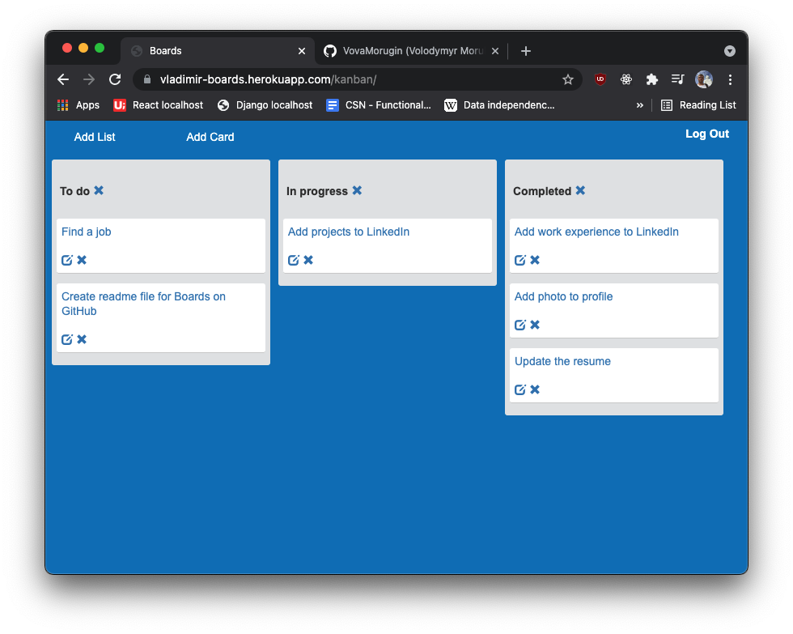
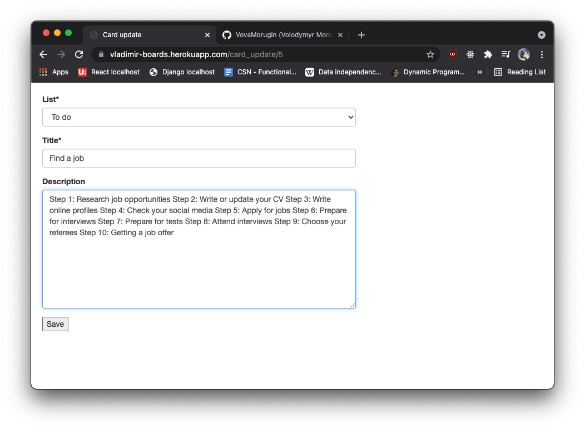
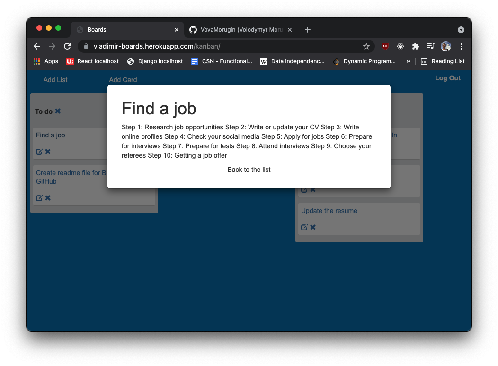
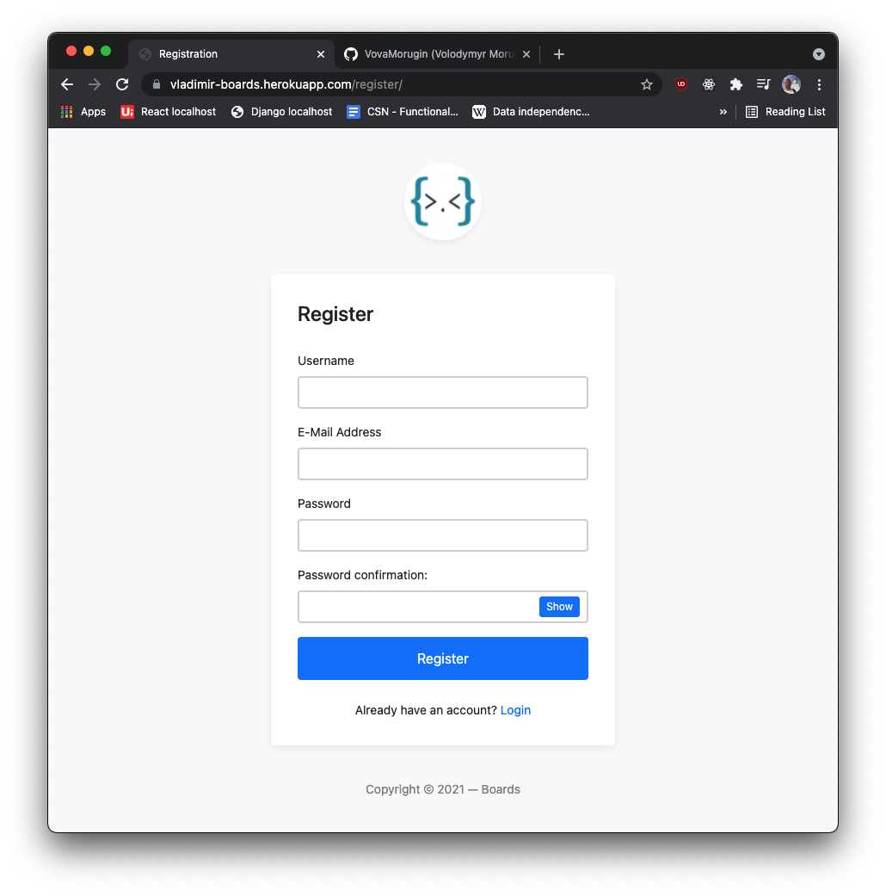
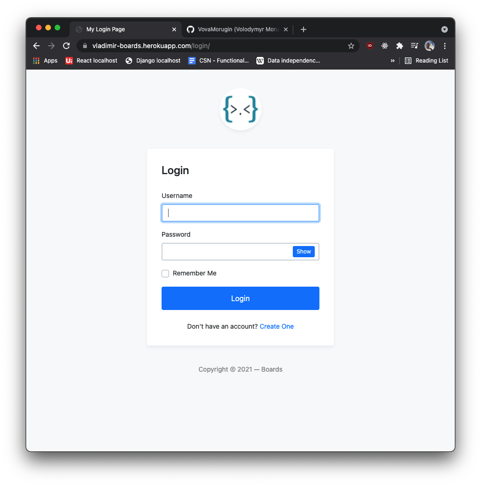

<h2>The Boards is a kanban-style personal project management tool. </h1>

https://vladimir-boards.herokuapp.com/

Technologies used:

- Python
- Django Framework
- HTML/CSS/Bootstrap
- JavaScript
- Heroku for hosting

 
 
<h3>One example of usage is to keep track of tasks that are to be done, in progress or completed.</h3>

<h3>Main screen:</h3>

<h3>Adding and modifying tasks</h3>

<h3>Viewing task info:</h3>

<h3>Registration</h>

<h3>Log In</h3>

